# MSc_S4_AppliedAIAndAlgorithm

## Intro
Personal robots intro.

Deep Blue - AlphaGo intro.
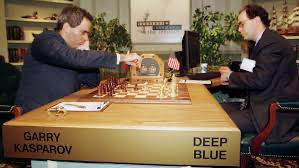
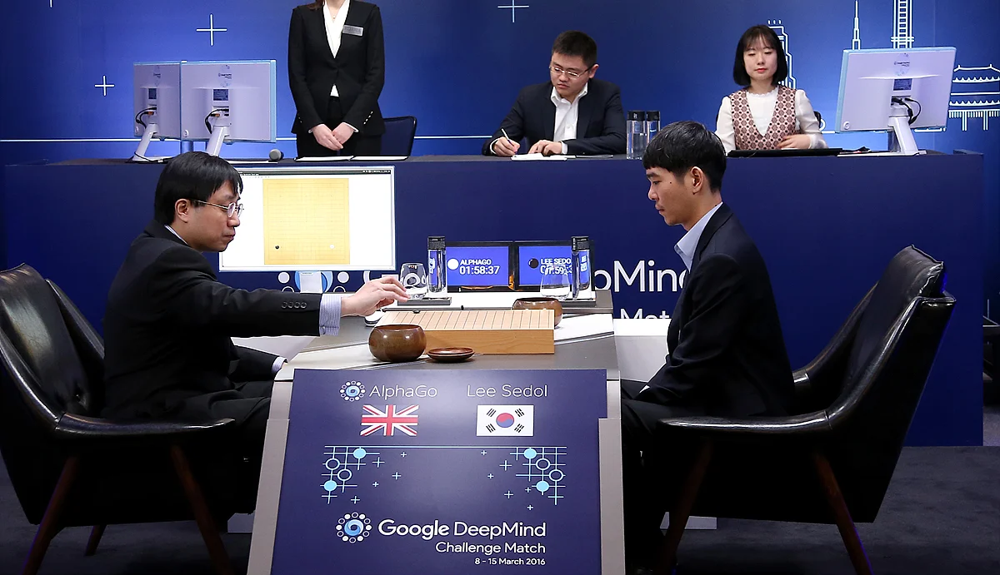

OpenAI Five intro.
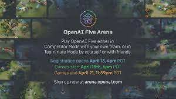

Intelligent entities that simulate humans:
- think
    - humanly
    - rationally
- action
    - humanly
    - rationally (hành vi hợp lí đang được chú trọng)

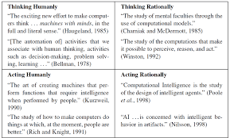

Intro. Turing Test
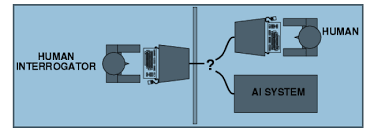
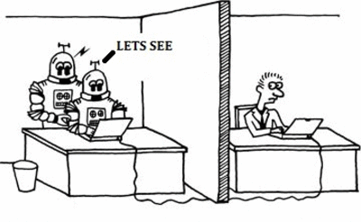
- Reverse Turing Test: CAPTCHA
- Total Turing 
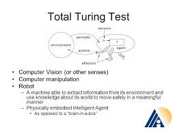

Other Intelligent Tests:
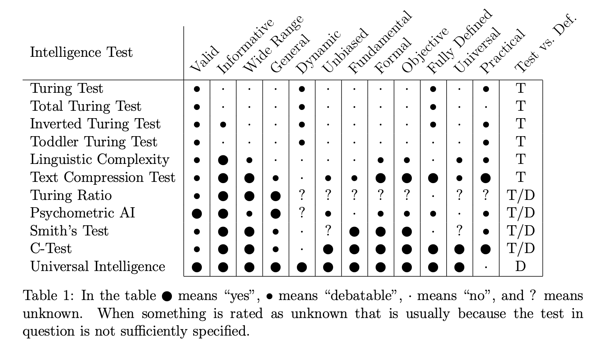

Think rational:
- dùng các quy luật
- nhưng ko phải cái gì cũng có thể mô tả được dưới dạng các quy luật

Act rational:
- thực hiện hành động đạt mục đích mà tối ưu hoá lợi ích
- do the right thing -> archieve aims

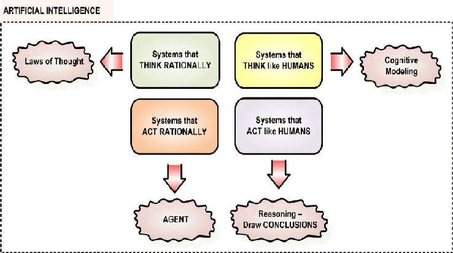

AI Research:
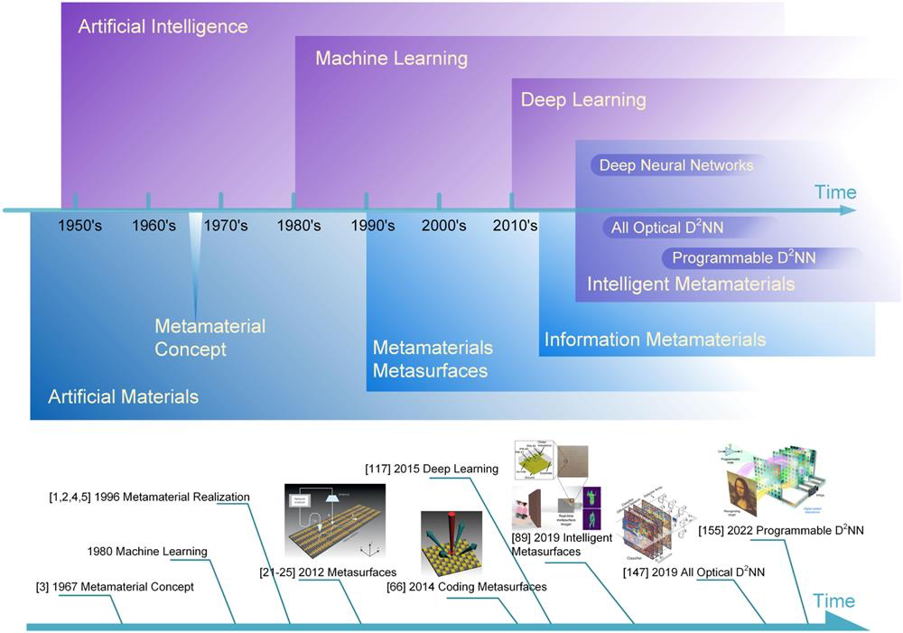

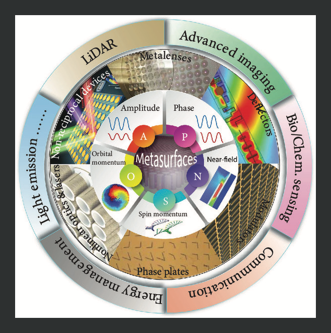

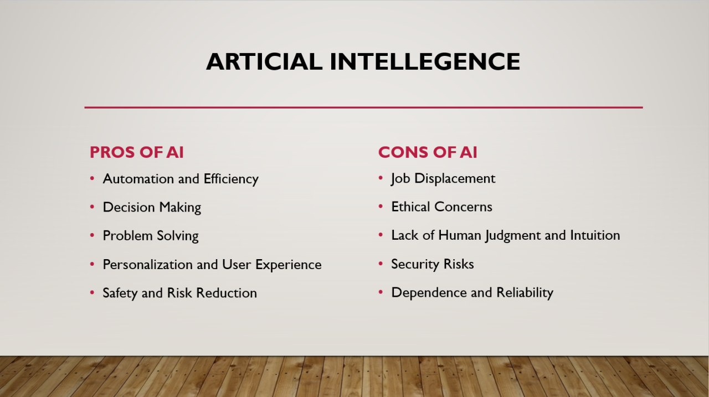

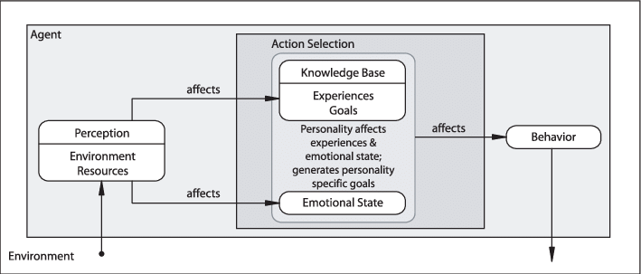

## 281123
A star
h < h*, nghĩa là h nhỏ hơn tổng cost của quãng đường đi tiếp theo từ node đang xét đến đích

Graph search: node nào duyệt rồi thì ko duyệt nữa

Tree search: node duyệt rồi vẫn có thể duyệt lại

## 121223

adversarial search - tìm kiếm đối kháng 

- multi-agent
- agent thay đổi theo hành động của mình
- env không thay đổi theo hành 

lý thuyết trò chơi - 

3 loại chính:
- perfect 
    - deter.
    - chance (có yếu tố ngẫu nhiên)
- imperfect.
    - chance

games vs. search
- không gian lớn hơn. vd: chess -> graph of 10^40 nodes or search tree of 10^154 nodes =))
- Thời gian: thường có giới hạn thời gian
- tối ưu: không tối ưu thì thua, cách biệt lớn 

giả sử cơ sở cho bài toán chơi cờ:
- có 2 người chơi và chơi luân phiên theo lượt: max - tối đa điểm, min - tối thiểu điểm
- quan sát đầy đủ môi trường
- zero-sum games: tổng điểm bằng 0, thắng +1, thua -1, hoà 0

alpha beta search (branch pruning) -> checker -> deep blue -> chess
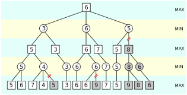

machine learning + monte carlo + learn from human + learn by itself -> AlphaGo -> go
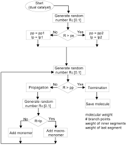

optimal decisions in games
1. Minimax
- duyệt qua toàn bộ cây nhưng không lưu toàn bộ cây (chỉ lưu một nhánh đã chọn đi qua) => time complex.: O($b^m$), space complex.: O(bm)
- Ưu: luôn tìm được lời giải tối ưu
- Khuyết: đòi hỏi đối phương chơi tối ưu, độ phức tạp quá lớn
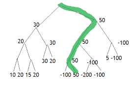
nếu cần tìm node cha là của max thì lấy max của các node con 
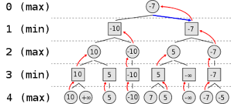
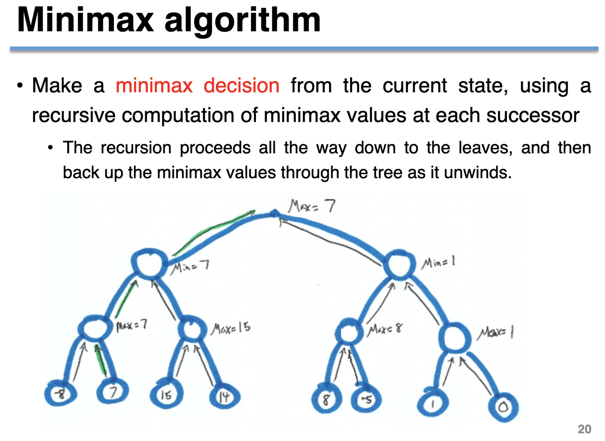

multi-player sẽ có thể hình thành liên minh (alliances), 2 thằng íu liê minh đập 1 thằng mạnh, xong 2 thằng íu đập nhau =))

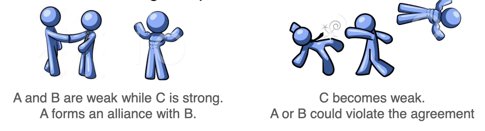

giải quyết vấn đề của minimax
- alpha beta pruning: tỉa bỏ nhánh ko tiềm năng
- bounded lookahead (do minimax đòi hỏi phải nhìn hết bàn cờ đến nước cuối cùng): tìm kiếm có giới hạn độ sâu

alpha beta pruning
- đặt giới hạn miền ($\alpha$, $\beta$) cho root
- duyệt cây từ node lá lên root
- min thì đổi chặn trên (beta), max thì đổi chặn dưới (alpha) -> đến khi alpha > beta thì dừng mở rộng node; hoặc alpha = beta -> dừng lun thuật toán
- khi miền của node con giao với miền của node cha là rỗng, ta không mở rộng thêm nữa vì chúng sẽ trở nên vô nghĩa
- thứ tự duyệt nhánh ảnh hưởng đến kết quả chặt cây, mặc dù kết quả cuối cùng không đổi
 
 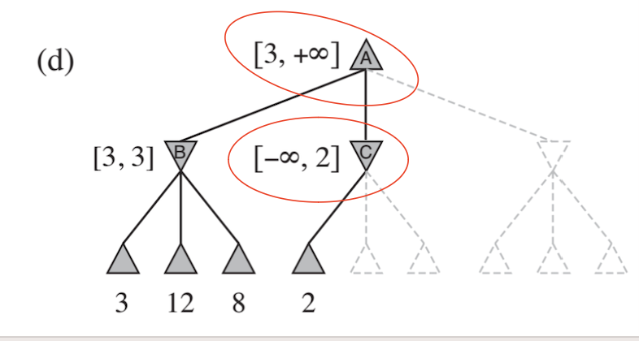

 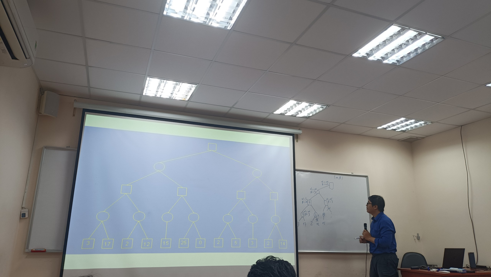

imperfect real-time decisions - khi không mở rộng đến kết quả cuối cùng của ván cờ
- heuristic minimax:
    - áp dụng biện pháp để cutoff nhằm giới hạn độ sâu khi mở rộng cây
    - khi đạt độ sâu đối đa quy định -> ước lượng giá trị (lượng giá)
    - thứ tự chọn phải có sự tương ứng nhất định mới giá trị vừa lượng gía
    - hàm lượng giá (evaluation functions)
    - chỉ cutoff khi không có biến động mạnh 
    - quiescent position = vị trí ít biến động

stochastic games (có yếu tố xác suất/random) - nếu đối phương đi không thuần tối ưu 
- ước lượng xác suất bước đi tiếp theo của đối phương
- expectimax search: tính điểm trung bình theo xác suất ước lượng
- expectimax pruning
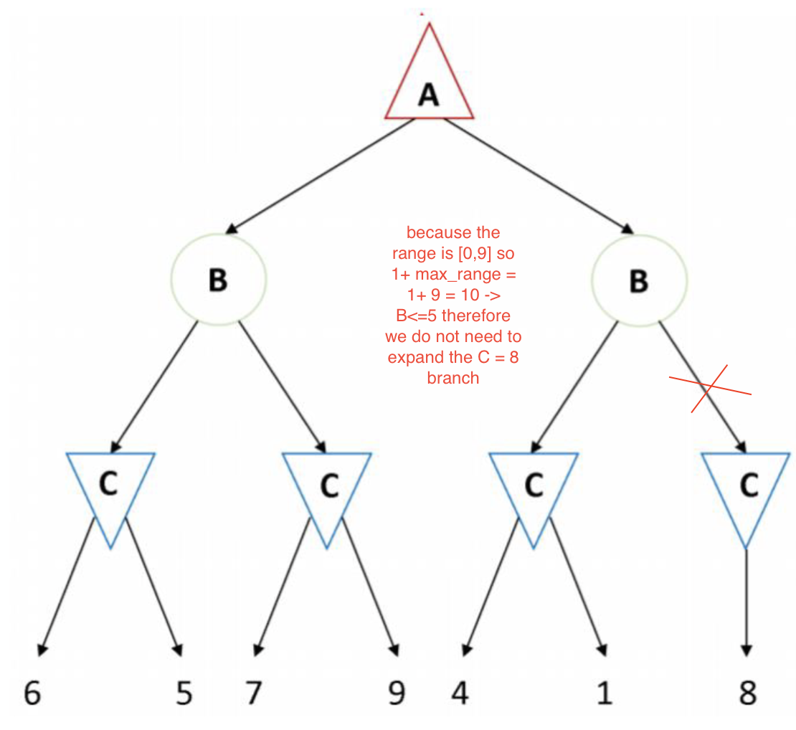

## 191223
## Logical Agent

### Propotional logic (logic mệnh đề)

Model

Entailment

## Recordings
- https://studenthcmusedu-my.sharepoint.com/:f:/g/personal/22c11005_student_hcmus_edu_vn/EricpBdsOgRFpXAlDUjBr1wBlsxCzNtOhy7M0FCfxs_Dpg?e=mjKGtG